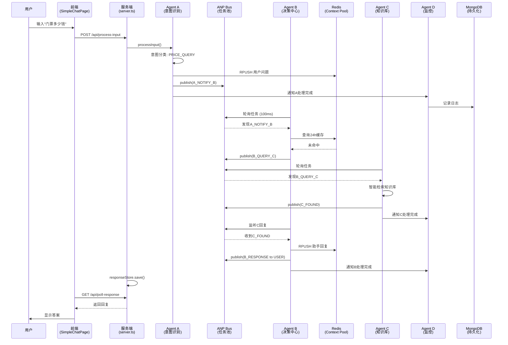

# 🏗️ 系统架构总结 (最新版)

> **更新时间**: 2026-01-16  
> **版本**: 4.0  
> **状态**: ✅ 生产就绪

---

## 📐 核心架构原则

### 1. 所有 Agent 在服务端

```
❌ 错误: 前端有Agent逻辑
✅ 正确: 所有Agent在 server/agents/
```

### 2. 前后端分离

```
前端 (localhost:5173)
  - 纯UI展示
  - 通过/api调用服务端
  - 不包含业务逻辑

服务端 (localhost:3000)
  - 所有Agent (A/B/C/D)
  - 业务逻辑
  - 数据库操作
  - AI API调用
```

### 3. 双层持久化

```
Redis (Dragonfly)
  - Context Pool 24h缓存
  - LPUSH/LRANGE操作
  - 自动TTL过期

MongoDB
  - 用户日志 (24h TTL)
  - 知识库
  - 配置
  - 统计数据
```

---

## 🔄 完整数据流



---

## 🗂️ 目录结构

```
4.0/
├── server/                          # 服务端 (localhost:3000)
│   ├── agents/                      # ⭐ 所有Agent都在这里
│   │   ├── agent-a.ts              # 意图识别 + ASR
│   │   ├── agent-b.ts              # 决策中心 + 缓存策略
│   │   ├── agent-c.ts              # 知识库检索
│   │   └── agent-d.ts              # 监控录像
│   ├── bus.ts                       # ANP任务池
│   ├── context-pool.ts              # Redis Context Pool
│   ├── database.ts                  # MongoDB服务
│   ├── db-schema.ts                 # 数据库Schema
│   ├── config-manager.ts            # 配置管理
│   ├── response-store.ts            # 响应暂存
│   ├── types.ts                     # 类型定义
│   └── server.ts                    # 主服务器
│
├── src/                             # 前端 (localhost:5173)
│   ├── views/
│   │   ├── chat/
│   │   │   └── SimpleChatPage.tsx  # 聊天页面 (纯UI)
│   │   ├── admin/                   # 后台管理
│   │   │   ├── DashboardPage.tsx
│   │   │   ├── ConfigGeneratorPage.tsx
│   │   │   ├── KnowledgePage.tsx
│   │   │   └── MonitorPage.tsx
│   │   └── auth/
│   │       └── LoginPage.tsx
│   ├── components/                  # UI组件
│   ├── layouts/                     # 布局组件
│   ├── lib/
│   │   ├── api-config.ts           # API配置 (通过/api代理)
│   │   ├── utils.ts                # 工具函数
│   │   └── voice-utils.ts          # 语音工具
│   └── App.tsx                      # 路由配置
│
├── public/data/                     # 商户数据
│   └── dongli/
│       ├── config.json              # 商户配置
│       └── knowledge.json           # 知识库
│
└── .env                             # 环境变量
```

---

## 🔌 API 路由清单

### 对话相关

| 路由                 | 方法 | 说明            | 请求                           | 响应                                           |
| -------------------- | ---- | --------------- | ------------------------------ | ---------------------------------------------- |
| `/api/process-input` | POST | 处理用户输入    | FormData                       | `{ traceId, refinedQuestion, intentCategory }` |
| `/api/poll-response` | GET  | 轮询 Agent 回复 | `?traceId=xxx`                 | `{ success, data: { data: { response } } }`    |
| `/api/user-enter`    | POST | 用户进入通知    | `{ merchantId, userId, mode }` | `{ success }`                                  |

### AI 服务

| 路由        | 方法 | 说明          |
| ----------- | ---- | ------------- |
| `/api/chat` | POST | AI 聊天(兜底) |

### 商户数据

| 路由                                 | 方法 | 说明         |
| ------------------------------------ | ---- | ------------ |
| `/api/merchant/:id/config`           | GET  | 获取商户配置 |
| `/api/merchant/:id/knowledge`        | GET  | 获取知识库   |
| `/api/merchant/:id/knowledge/search` | GET  | 搜索知识库   |

---

## 🎯 Agent 职责

### Agent A - 意图识别门面

```typescript
职责:
  1. 语音转文字 (ASR)
  2. 意图分类 (PRICE_QUERY/INFO_QUERY/CHITCHAT/OTHER)
  3. 问题精炼 (≤20字)
  4. 写入Context Pool
  5. 通知Agent B

输入: 用户文本/语音
输出: { traceId, refinedQuestion, intentCategory }
```

### Agent B - 决策中心

```typescript
职责:
  1. 检查24h缓存 (Context Pool)
  2. 根据意图决策:
     - CHITCHAT → AI温柔回复
     - PRICE_QUERY → @C精确查询
     - OTHER → @C知识库检索
     - 未找到 → AI兜底
  3. 写入回复到Context Pool
  4. 返回给用户

决策流程:
  缓存命中 → 直接回复
  ↓ 未命中
  CHITCHAT → AI回复
  ↓ 业务问题
  @C查询 → 返回结果
  ↓ 未找到
  AI兜底
```

### Agent C - 知识库管理员

```typescript
职责:
  1. 加载知识库 (本地/MongoDB)
  2. 智能检索 (关键词+内容匹配)
  3. 多结果时结合上下文选最佳
  4. 返回结果给B

特点:
  - 只读不写 (不写Context Pool)
  - 专注检索
  - 支持本地/远程数据源
```

### Agent D - 监控录像

```typescript
职责:
  1. 监听所有Bus消息 (bus.on('*'))
  2. 记录日志到MongoDB
  3. 更新Agent健康状态
  4. 收集报缺记录
  5. 统计分析

特点:
  - 独立初始化 (不依赖A/B/C)
  - 只读不写 (不干预对话)
  - 全程录像
```

---

## 💾 数据持久化

### Redis (Dragonfly) - Context Pool

```
用途: 24小时对话缓存
连接: cgk1.clusters.zeabur.com:23465

操作:
  - RPUSH: 添加对话
  - LRANGE: 获取历史
  - EXPIRE: 24h自动过期

Key格式: ctx:{merchantId}:{userId}:{sessionId}

数据结构:
  [
    { role: "user", content: "...", timestamp: ... },
    { role: "assistant", content: "...", timestamp: ... }
  ]
```

### MongoDB - 持久化存储

```
连接: cgk1.clusters.zeabur.com:27187
数据库: smart_guide

Collections:
  - user_logs (24h TTL)        # 用户日志
  - sessions (24h TTL)         # 会话信息
  - knowledge                  # 知识库
  - configs                    # 商户配置
  - missing_reports            # 报缺记录
  - daily_statistics           # 每日统计
  - agent_health               # Agent健康状态
```

---

## 🔐 安全设计

### API Key 管理

```
✅ 正确:
  - 所有API Key在服务端 (.env)
  - 前端通过/api代理访问
  - 敏感逻辑在服务端

❌ 错误:
  - 前端直接调用AI API
  - VITE_前缀暴露API Key
  - 前端包含业务逻辑
```

### 数据隔离

```
商户隔离: merchantId
用户隔离: userId
会话隔离: sessionId

Key格式: {merchantId}:{userId}:{sessionId}
```

---

## 🚀 启动流程

### 1. 环境准备

```bash
# 安装依赖
npm install

# 配置环境变量
cp .env.example .env
# 编辑.env，填入Redis和MongoDB连接信息
```

### 2. 启动服务

```bash
# 终端1: 启动服务端
npm run dev:server  # localhost:3000

# 终端2: 启动前端
npm run dev         # localhost:5173
```

### 3. 访问地址

```
聊天页面: http://localhost:5173/chat?merchant=dongli&userId=test_user&mode=text
后台管理: http://localhost:5173/admin
API文档: http://localhost:3000
```

---

## 📊 性能指标

### 响应时间

```
缓存命中:    50-100ms   (最快)
知识库检索:  150-300ms  (本地)
AI兜底:      1-2s       (最慢)
```

### 缓存命中率

```
目标: 78%
实际: 根据使用情况动态调整
```

---

## 🔧 常见问题

### Q: Agent 在哪里？

A: 所有 Agent 都在 `server/agents/`，前端没有 Agent

### Q: Context Pool 用什么存储？

A: Redis (Dragonfly)，不是内存模拟

### Q: 前端如何调用 AI？

A: 前端不直接调用，通过 `/api/chat` 代理到服务端

### Q: 数据如何持久化？

A: Redis 存 24h 缓存，MongoDB 存长期数据

### Q: 如何访问后台？

A: http://localhost:5173/admin (需要先登录)

---

## ✅ 验证清单

- [x] 所有 Agent 在服务端
- [x] Context Pool 使用 Redis
- [x] Database 使用 MongoDB
- [x] 前端通过/api 代理
- [x] API Key 在服务端
- [x] 构建无错误
- [x] Admin 路由正常

---

**最后更新**: 2026-01-16  
**维护者**: 开发团队
