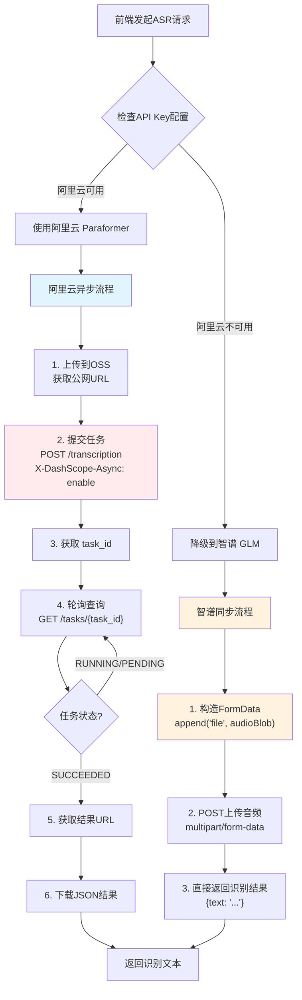
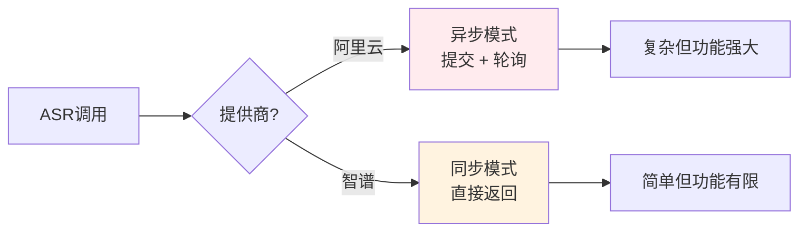
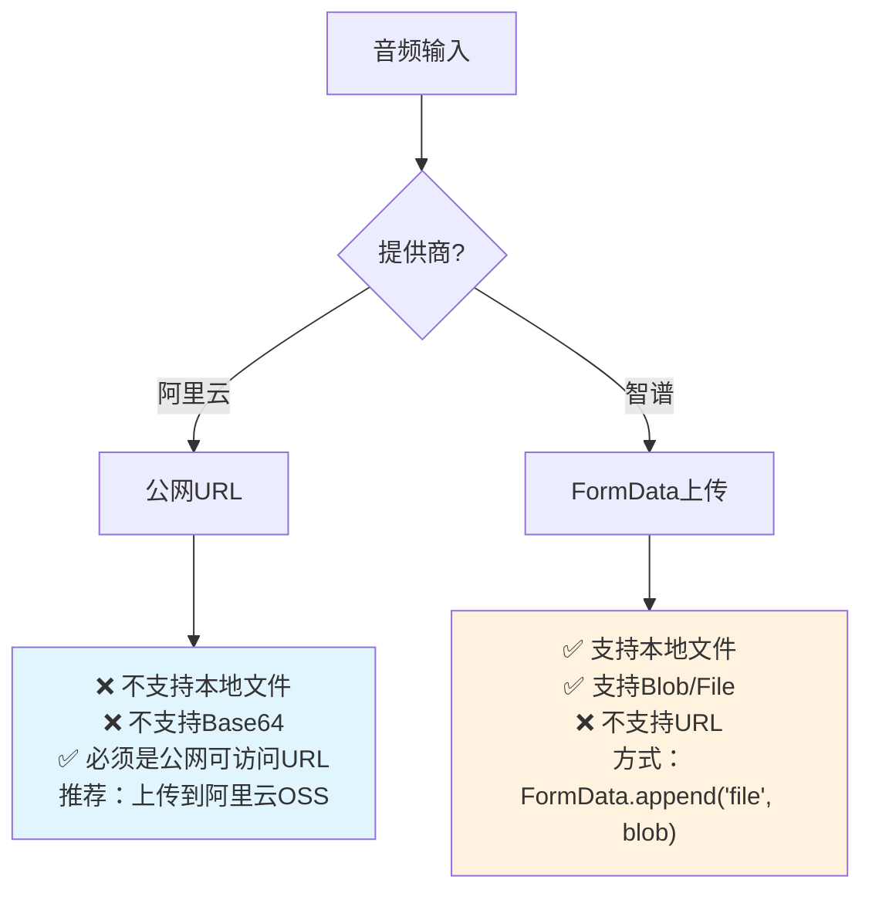
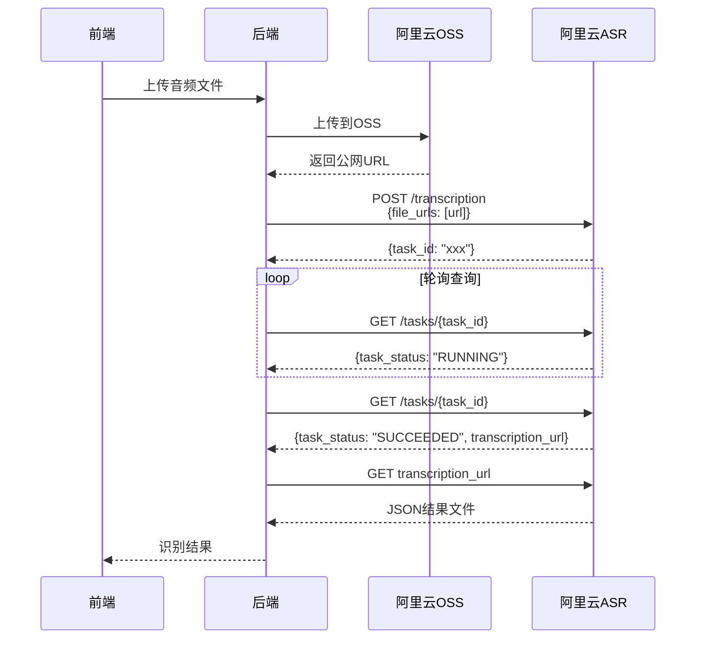

# ASR API 提供商差异说明

> 创建时间：2026-01-20  
> 基于官方文档的准确对比，避免混淆

## 🚨 重要更新（基于官方示例）

阿里云实际提供 **两种** ASR 服务：
1. **WebSocket 实时 ASR**（`fun-asr-realtime`） - 适合实时语音识别 ✅
2. **RESTful 批量转写**（`paraformer-v2`） - 适合长音频文件转写

**我们应该使用的是 WebSocket 实时 ASR！**

## 📊 核心差异对比表（实时 ASR）

| 对比项 | 阿里云 WebSocket ASR | 智谱 HTTP ASR | 关键注意事项 |
|--------|---------------------|---------------|--------------|
| **模型** | `fun-asr-realtime` | `glm-asr-2512` | 不同模型系列 |
| **接口类型** | ⚠️ WebSocket（全双工流式） | ⚠️ HTTP（同步请求） | **完全不同！** |
| **调用方式** | run-task → stream → finish-task | POST FormData 直接返回 | ⚠️ 流程差异大 |
| **输入方式** | ⚠️ 文件URL（公网可访问） | ⚠️ FormData上传 | **完全不同！** |
| **采样率** | 任意采样率 | 未明确 | 阿里云更灵活 |
| **支持格式** | aac, amr, avi, flac, flv, m4a, mkv, mov, mp3, mp4, mpeg, ogg, opus, wav, webm, wma, wmv | wav, mp3, flac, ogg, m4a, aac, webm | 阿里云格式更多 |
| **文件大小** | ≤2GB | 未明确 | - |
| **时长限制** | ≤12小时 | ≤60秒 | ⚠️ 差异巨大！ |
| **批量处理** | ✅ 最多100个URL | ❌ 不支持 | 阿里云支持批量 |
| **多语种** | ✅ 中英日韩德法俄 | ❌ 仅中文 | 阿里云支持更多 |
| **方言支持** | ✅ 18种中文方言 | ❌ 不支持 | 阿里云优势 |
| **热词定制** | ✅ 支持 | ❌ 不支持 | 阿里云优势 |
| **说话人分离** | ✅ 支持 | ❌ 不支持 | 阿里云优势 |
| **时间戳** | ✅ 词级别 | ✅ 支持 | 都支持 |

## 🔄 ASR 调用流程对比



## ⚠️ 关键差异详解

### 1. 接口类型差异（最关键！）



**阿里云 - 异步模式**：
```javascript
// 步骤1：提交任务
const submitResponse = await fetch('/api/v1/services/audio/asr/transcription', {
  method: 'POST',
  headers: {
    'Authorization': `Bearer ${API_KEY}`,
    'X-DashScope-Async': 'enable',  // ⚠️ 必须！
    'Content-Type': 'application/json'
  },
  body: JSON.stringify({
    model: 'paraformer-v2',
    input: {
      file_urls: ['https://example.com/audio.wav']  // ⚠️ 必须是公网URL
    }
  })
});
const { task_id } = await submitResponse.json();

// 步骤2：轮询查询结果
let result = null;
while (!result) {
  const queryResponse = await fetch(`/api/v1/tasks/${task_id}`, {
    method: 'GET',
    headers: { 'Authorization': `Bearer ${API_KEY}` }
  });
  const data = await queryResponse.json();
  
  if (data.task_status === 'SUCCEEDED') {
    // 步骤3：下载结果
    const transcriptionUrl = data.results[0].transcription_url;
    result = await fetch(transcriptionUrl).then(r => r.json());
  }
  await sleep(100); // 等待100ms后重试
}
```

**智谱 - 同步模式**：
```javascript
// 一次请求直接返回
const formData = new FormData();
formData.append('model', 'glm-asr-2512');
formData.append('file', audioBlob, 'audio.wav');  // ⚠️ 直接上传文件

const response = await fetch('/api/paas/v4/audio/transcriptions', {
  method: 'POST',
  headers: { 'Authorization': `Bearer ${API_KEY}` },
  body: formData  // ⚠️ multipart/form-data
});
const { text } = await response.json();  // 直接得到结果
```

### 2. 输入方式差异



### 3. 时长限制差异

| 提供商 | 时长限制 | 适用场景 |
|--------|----------|----------|
| 阿里云 | ≤12小时 | ✅ 会议录音、长音频 |
| 智谱 | ≤60秒 | ⚠️ 仅适合短语音 |

### 4. 我们当前的实现问题

**❌ 当前代码的问题**：
```typescript
// 我们现在用的是"兼容模式"，但按照智谱的方式调用
const formData = new FormData();
formData.append('model', DASHSCOPE_API.models.asr);
formData.append('file', audioBlob, 'audio.wav');

// ❌ 这种方式不符合阿里云官方文档！
// 阿里云要求：
// 1. 必须有 X-DashScope-Async: enable 请求头
// 2. 输入必须是 file_urls（公网URL），不是 file
```

## 🔧 正确的实现方式

### 方案A：完整实现阿里云异步流程



### 方案B：保持当前智谱方式（推荐）

由于：
1. 智谱 ASR 更简单（同步返回）
2. 阿里云异步流程需要 OSS 支持
3. 我们主要处理短语音（<60秒）

**建议**：继续优先使用智谱 ASR，阿里云作为备用。

## 📝 配置建议

```json
{
  "apiConfig": {
    "asr": {
      "primary": "zhipu",         // 主用智谱（简单、适合短语音）
      "backup": ["dashscope"],    // 备用阿里云（需要实现完整流程）
      "maxDuration": 60           // 最大60秒
    }
  }
}
```

## 💡 最佳实践

### 当前实现保持不变

```typescript
// 智谱 ASR（当前方式，正确）
const formData = new FormData();
formData.append('model', 'glm-asr-2512');
formData.append('file', audioBlob, 'recording.wav');

const response = await fetch(
  'https://open.bigmodel.cn/api/paas/v4/audio/transcriptions',
  {
    method: 'POST',
    headers: { 'Authorization': `Bearer ${ZHIPU_API_KEY}` },
    body: formData
  }
);
```

### 如果要使用阿里云（需完整重构）

需要实现：
1. **OSS 上传功能**：将音频上传到阿里云 OSS
2. **异步任务管理**：提交任务 + 轮询状态
3. **结果下载**：从 transcription_url 下载 JSON 结果

## 🎯 功能对比总结

| 功能 | 阿里云 Paraformer | 智谱 GLM | 推荐 |
|------|-------------------|----------|------|
| **易用性** | ⭐⭐ 复杂 | ⭐⭐⭐⭐⭐ 简单 | 智谱 |
| **短语音(<60s)** | ⭐⭐⭐ 可用 | ⭐⭐⭐⭐⭐ 完美 | 智谱 |
| **长音频(>60s)** | ⭐⭐⭐⭐⭐ 支持12小时 | ❌ 不支持 | 阿里云 |
| **多语种** | ⭐⭐⭐⭐⭐ 7种语言 | ⭐⭐⭐ 仅中文 | 阿里云 |
| **方言识别** | ⭐⭐⭐⭐⭐ 18种方言 | ❌ 不支持 | 阿里云 |
| **实时性** | ⭐⭐⭐ 异步轮询 | ⭐⭐⭐⭐⭐ 同步返回 | 智谱 |
| **实施难度** | ⭐⭐ 需要OSS | ⭐⭐⭐⭐⭐ 即插即用 | 智谱 |

## 🚨 常见错误

### 错误1：阿里云用 FormData 上传文件

```javascript
// ❌ 错误：阿里云不支持这种方式
const formData = new FormData();
formData.append('file', audioBlob);
fetch('https://dashscope.aliyuncs.com/api/v1/services/audio/asr/transcription', {
  body: formData  // ❌ 错误！
});

// ✅ 正确：必须用 file_urls
fetch('https://dashscope.aliyuncs.com/api/v1/services/audio/asr/transcription', {
  headers: {
    'X-DashScope-Async': 'enable',  // ⚠️ 必须
    'Content-Type': 'application/json'
  },
  body: JSON.stringify({
    model: 'paraformer-v2',
    input: {
      file_urls: ['https://your-oss.com/audio.wav']  // ✅ 公网URL
    }
  })
});
```

### 错误2：智谱用 URL 提交

```javascript
// ❌ 错误：智谱不支持URL
fetch('https://open.bigmodel.cn/api/paas/v4/audio/transcriptions', {
  body: JSON.stringify({
    file_url: 'https://example.com/audio.wav'  // ❌ 不支持
  })
});

// ✅ 正确：必须用 FormData 上传文件
const formData = new FormData();
formData.append('file', audioBlob, 'audio.wav');
fetch('https://open.bigmodel.cn/api/paas/v4/audio/transcriptions', {
  body: formData  // ✅ 正确
});
```

## 📂 相关文件

| 文件 | 作用 | 需要修改 |
|------|------|----------|
| `server/config/api-config.ts` | ASR配置定义 | ❌ 当前配置正确 |
| `server/services/api-service.ts` | ASR调用实现 | ⚠️ 如果要用阿里云需重构 |
| `server/agents/agent-a.ts` | 接收音频输入 | ❌ 无需修改 |

## 🎯 结论

**当前策略（推荐）**：
- ✅ 主用：智谱 GLM ASR（简单、稳定、适合短语音）
- ⚠️ 备用：阿里云 Paraformer（需完整重构才能使用）

**何时考虑阿里云**：
- 需要识别超过60秒的长音频
- 需要多语种支持（日韩德法俄）
- 需要方言识别（粤语、东北话等）
- 有预算实现 OSS + 异步轮询架构

---

**更新记录**：
- 2026-01-20：基于官方文档创建，明确两者完全不同的调用方式
