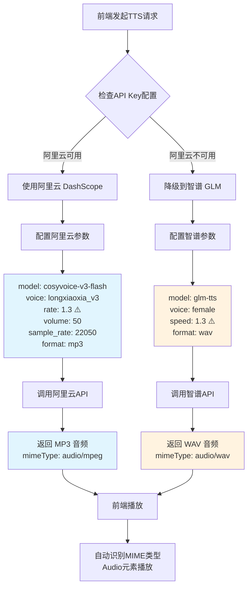
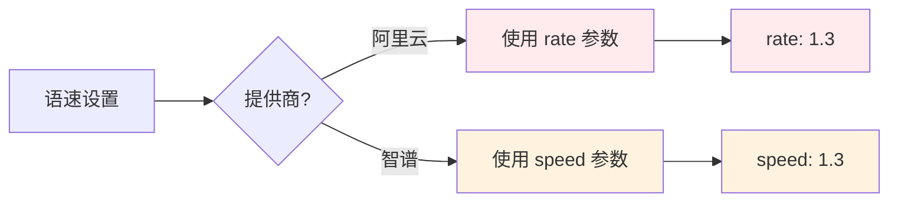
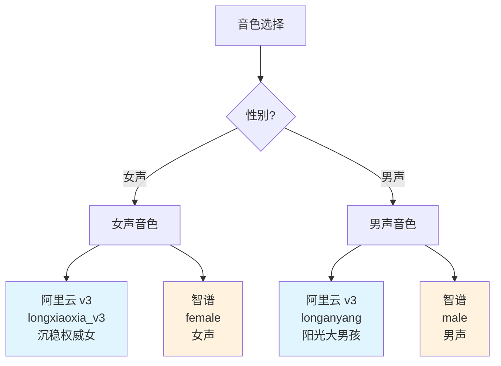
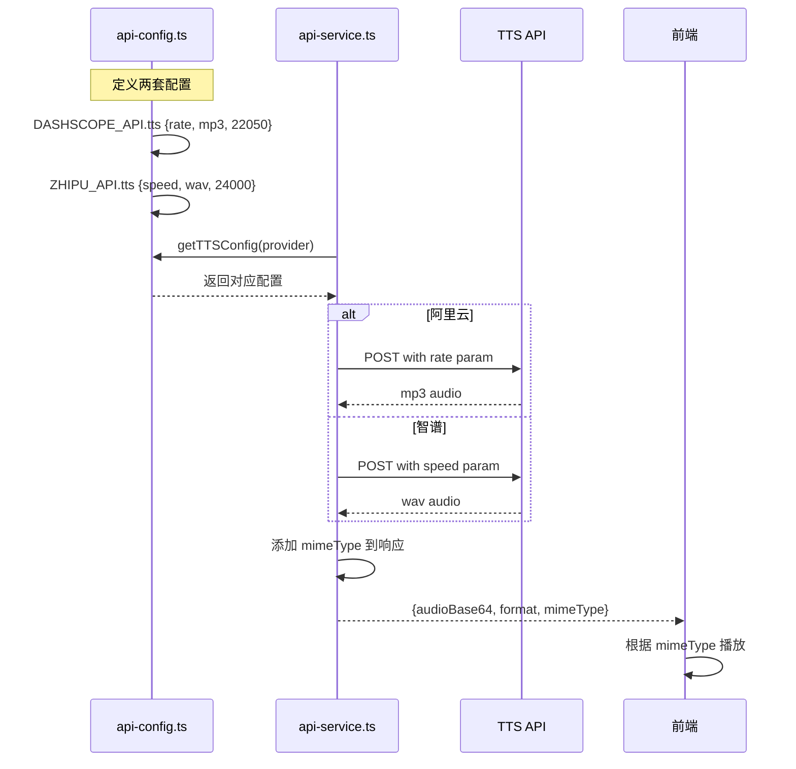
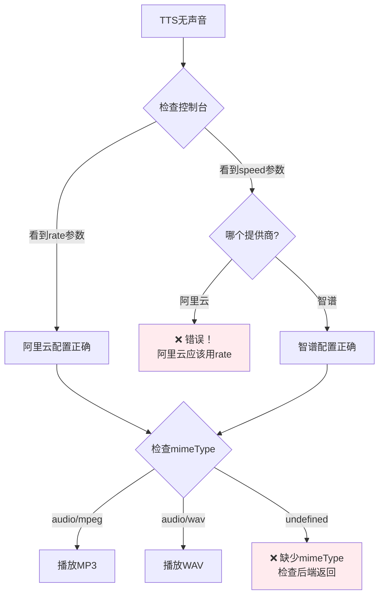

# TTS API 提供商差异说明

> 创建时间：2026-01-20  
> 基于官方文档的准确对比，避免混淆

## 📊 核心差异对比表

| 对比项 | 阿里云 DashScope | 智谱 GLM | 关键注意事项 |
|--------|------------------|----------|--------------|
| **模型** | `cosyvoice-v3-flash` | `glm-tts` | 不同模型系列 |
| **女声** | `longxiaoxia_v3` | `female` | ⚠️ 音色名完全不同 |
| **语速参数** | ✅ `rate` | ✅ `speed` | ⚠️ **参数名不同！** |
| **采样率** | `22050` Hz | `24000` Hz | ⚠️ 默认值不同 |
| **格式** | `mp3` | `wav` | ⚠️ MIME类型不同 |
| **音量** | ✅ `volume` | ❌ 不支持 | 功能差异 |
| **音调** | ✅ `pitch` | ❌ 不支持 | 功能差异 |

## 🔄 TTS 调用流程对比



## ⚠️ 关键注意事项

### 1. 语速参数名差异（最容易出错）



**错误示例：**
```json
// ❌ 错误：阿里云使用了 speed
{
  "model": "cosyvoice-v3-flash",
  "voice": "longxiaoxia_v3",
  "speed": 1.3  // ❌ 应该用 rate
}

// ✅ 正确
{
  "model": "cosyvoice-v3-flash", 
  "voice": "longxiaoxia_v3",
  "rate": 1.3  // ✅ 正确
}
```

### 2. 音色名称差异



### 3. 配置管理流程



## 🎯 商家配置建议

在 `config.json` 中配置主备提供商：

```json
{
  "apiConfig": {
    "tts": {
      "primary": "dashscope",    // 主用阿里云（功能更多）
      "backup": ["zhipu"],       // 备用智谱
      "speed": 1.3,              // 统一语速配置
      "voice": "female"          // 统一性别配置
    }
  }
}
```

系统会自动：
1. 根据提供商转换参数名（`speed` → `rate` 或 `speed`）
2. 转换音色名（`female` → `longxiaoxia_v3` 或 `female`）
3. 设置正确的格式和 MIME 类型

## 📂 相关文件

| 文件 | 作用 | 关键点 |
|------|------|--------|
| `server/config/api-config.ts` | TTS配置定义 | 定义两套完整配置 |
| `server/services/api-service.ts` | TTS调用实现 | 根据提供商使用不同参数 |
| `src/views/chat/SimpleChatPage.tsx` | 前端播放 | 自动识别mimeType |

## 🔍 调试建议

### 如何验证配置正确？

1. **查看日志**：
   ```
   [TTS] 播放音频: provider=dashscope, format=mp3, mimeType=audio/mpeg
   ```

2. **检查请求体**：
   - 阿里云应该看到 `rate` 参数
   - 智谱应该看到 `speed` 参数

3. **检查响应**：
   - 阿里云返回 MP3
   - 智谱返回 WAV

### 常见问题排查



## 💡 最佳实践

1. **优先使用阿里云**：
   - 功能更丰富（音量、音调、Instruct）
   - 格式更小（MP3 vs WAV）
   - 价格透明（1元/万字符）

2. **智谱作为备用**：
   - 配置简单
   - 音质稳定
   - 参数更少

3. **统一配置管理**：
   - 商家只需配置 `speed` 和 `voice`
   - 系统自动转换为对应提供商的参数
   - 前端自动适配不同格式

4. **测试建议**：
   - 分别测试两个提供商
   - 验证降级机制
   - 检查音频格式正确性

---

**更新记录**：
- 2026-01-20：基于官方文档创建，修正参数名和配置
