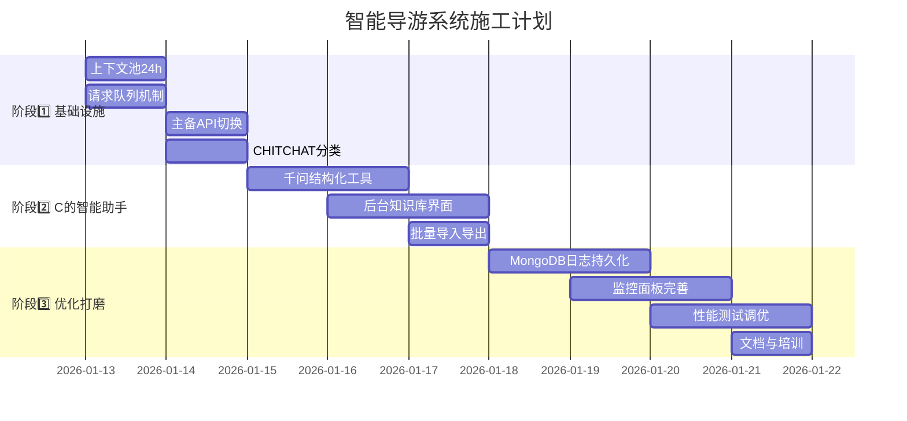

### 界面1: 知识库管理（最重要）

```
╔════════════════════════════════════════════════════╗
║  东里村景区 - 知识库管理    agentC  在这里有工作1                     ║
╠════════════════════════════════════════════════════╣
║                                                    ║
║  [➕ 添加新知识]  [📥 批量导入]  [📤 导出]  [🔄 同步到云] ║
║                                                    ║
║  ┌────────────────────────────────────────────┐  ║
║  │ 🤖 智能助手 - 粘贴即可，AI帮你整理          │  ║
║  ├────────────────────────────────────────────┤  ║
║  │ 粘贴你的文字（支持复制粘贴）:              │  ║
║  │ ┌────────────────────────────────────────┐ │  ║
║  │ │东里村景区门票成人60元每人，学生凭        │ │  ║
║  │ │学生证30元每人，60岁以上老人免费。       │ │  ║
║  │ │                                         │ │  ║
║  │ └────────────────────────────────────────┘ │  ║
║  │                                            │  ║
║  │  [🪄 AI智能整理]  [✏️ 手动填写]             │  ║
║  └────────────────────────────────────────────┘  ║
║                                                    ║
║  ┌────────────────────────────────────────────┐  ║
║  │ 📋 预览生成结果:                            │  ║
║  ├────────────────────────────────────────────┤  ║
║  │ 标题: 门票价格                             │  ║
║  │ 内容: 成人票60元/人，学生票30元/人（需凭   │  ║
║  │       学生证），60岁以上老人免费（需凭     │  ║
║  │       身份证）                              │  ║
║  │                                            │  ║
║  │ 关键词: 门票, 价格, 多少钱, 票, 收费, 免费│  ║
║  │ 分类: 💰 价格                              │  ║
║  │ 热门: ☑️ 是 (权重+10%)                     │  ║
║  │                                            │  ║
║  │  [✅ 确认保存]  [🔄 重新整理]  [❌ 取消]    │  ║
║  └────────────────────────────────────────────┘  ║
║                                                    ║
║  📊 当前知识库: 11条  |  最后更新: 2小时前         ║
║  ┌────────────────────────────────────────────┐  ║
║  │ ID   标题         分类  热门  操作          │  ║
║  ├────────────────────────────────────────────┤  ║
║  │ k_002 门票价格    💰   ⭐   [编辑] [删除]   │  ║
║  │ k_003 开放时间    ⏰   ⭐   [编辑] [删除]   │  ║
║  │ k_007 交通路线    🚗   ⭐   [编辑] [删除]   │  ║
║  │ k_009 推荐景点    📍   ⭐   [编辑] [删除]   │  ║
║  │ k_005 餐厅美食    🍜        [编辑] [删除]   │  ║
║  │ ...                                        │  ║
║  └────────────────────────────────────────────┘  ║
║                                                    ║
║  [1] [2] [3] ... [5]                 共计11条     ║
╚════════════════════════════════════════════════════╝
```

**操作流程**:
1. 商户复制粘贴文字
2. 点击"AI智能整理"
3. 查看预览，确认
4. 点击"确认保存"
5. 完成！ ✨

**设计理由**:
- ✅ 3步上手，商户都会用
- ✅ 所见即所得，不懂技术也OK
- ✅ AI帮忙提取关键词，省脑力

### 界面2: 配置管理

```
╔════════════════════════════════════════════════════╗
║  东里村景区 - 系统配置                             ║
╠════════════════════════════════════════════════════╣
║                                                    ║
║  📍 基本信息                                       ║
║  ─────────────────────────────────────────────     ║
║  商户ID: dongli                (不可修改)          ║
║  商户名称: [东里村景区___________________]         ║
║                                                    ║
║  💬 提示词配置                                      ║
║  ─────────────────────────────────────────────     ║
║  系统提示词:                                       ║
║  ┌────────────────────────────────────────────┐  ║
║  │ 你是东里村景区的智能导游助手，专门回答      │  ║
║  │ 景区相关问题。回答要礼貌、专业、简洁。     │  ║
║  └────────────────────────────────────────────┘  ║
║                                                    ║
║  欢迎语:                                           ║
║  ┌────────────────────────────────────────────┐  ║
║  │ 您好！欢迎来到东里村景区，我是智能导游    │  ║
║  │ 小助手，有什么可以帮您的？                 │  ║
║  └────────────────────────────────────────────┘  ║
║                                                    ║
║  🔧 API配置 (高级)                                 ║
║  ─────────────────────────────────────────────     ║
║  数据源: ● 本地文件  ○ MongoDB云数据库  ##批注：其他——点击后展开   如果商家需要用自己的数据库（敏感数据，请按照格式和要求字段自行设置）（点击展开细节。   ）          ║
║                                                    ║
║  语音识别(ASR):                                    ║
║  主选: [智谱 GLM ▼]  备选: [阿里云 ▼]   ## 其他——点击后展开  如使用三方模型请务必按照采样率和详细参数进行匹配。填写api地址：     填写key：   其他字段（点击添加）如自增         ║
║                                                    ║
║  语音合成(TTS):                                    ║
║  主选: [智谱 GLM ▼]  备选: [阿里云 ▼]  ##其他——点击后展开          ║
║                                                    ║
║  大模型(LLM):                                      ║
║  主选: [千问 Qwen ▼]  模型: [qwen3-0.5b ▼]     其他——点击后展开  ║
║  备选: [智谱 GLM ▼]   模型: [glm-4-flash ▼]      ║
║                                                    ║
║  📊 性能配置                                        ║
║  ─────────────────────────────────────────────     ║
║  缓存时长: [24] 小时                              ║
║  最大并发: [10] 个                                ║
║  语音限时: [60] 秒                                ║
║                                                    ║
║  [💾 保存配置]  [🔄 恢复默认]  [❌ 取消]           ║
║                                                    ║
╚════════════════════════════════════════════════════╝
```

### 界面3: 监控面板

```
╔════════════════════════════════════════════════════╗
║  东里村景区 - 实时监控       agentd工作汇报                      ║
╠════════════════════════════════════════════════════╣
║                                                    ║
║  ❤️ Agent健康状态                                  ║
║  ┌────────────────────────────────────────────┐  ║
║  │ Agent A  ✅ 健康   处理: 245次  平均: 150ms │  ║
║  │ Agent B  ✅ 健康   处理: 245次  平均: 200ms │  ║
║  │ Agent C  ✅ 健康   检索: 180次  平均: 50ms  │  ║
║  │ Agent D  ✅ 健康   记录: 490条  正常        │  ║
║  └────────────────────────────────────────────┘  ║
║                                                    ║
║  📊 今日统计 (实时更新)                            ║
║  ┌──────────────┬──────────────┬──────────────┐  ║
║  │ 对话总数     │ 缓存命中率   │ 平均响应     │  ║
║  │   245次      │    78%       │   0.3秒      │  ║
║  ├──────────────┼──────────────┼──────────────┤  ║
║  │ 语音对话     │ 文本对话     │ 报缺数       │  ║
║  │  98次(40%)   │ 147次(60%)   │   12次       │  ║
║  └──────────────┴──────────────┴──────────────┘  ║
║                                                    ║
║  🔄 业务流实时日志 (最近10条)        uuid查询：     其他字段查询：          查询列表下载 ║
║  ┌────────────────────────────────────────────┐  ║
║  │ 21:28:45 UUID-123 🎤 "门票多少钱"          │  ║
║  │   → A处理(150ms) → B缓存命中 → 回复(0.2s) │  ║
║  │   ✅ 完成                                   │  ║
║  ├────────────────────────────────────────────┤  ║
║  │ 21:28:30 UUID-456 ⌨️ "开放时间"           │  ║
║  │   → A处理(100ms) → B→C检索(50ms) → 回复   │  ║
║  │   ✅ 完成                                   │  ║
║  ├────────────────────────────────────────────┤  ║
║  │ 21:28:15 UUID-789 🎤 "天气怎么样"          │  ║
║  │   → A处理(120ms) → C未找到 → AI兜底       │  ║
║  │   ⚠️ 报缺记录                               │  ║
║  └────────────────────────────────────────────┘  ║
║                                                    ║
║  ⚠️ 报缺列表 (需要补充知识)                        ║
║  ┌────────────────────────────────────────────┐  ║
║  │ "天气怎么样" - 被问3次                      │  ║
║  │ "附近有没有酒店" - 被问2次                  │  ║
║  │ "可以带狗吗" - 被问1次                      │  ║
║  └────────────────────────────────────────────┘  ║
║                                                    ║
║  [📥 导出日志]  [🧹 清理缓存]  [🔄 刷新]          ║
║                                                    ║
╚════════════════════════════════════════════════════╝
```

---

## 📅 Agent小分队一天的工作日志

### 典型一天（东里村景区）

```
═══════════════════════════════════════════════════
      东里村景区 ABCD小分队工作日志       
           2026-01-12 周日（游客高峰）
═══════════════════════════════════════════════════

🌅 08:00 - 开门营业
─────────────────────────────────────────────────
系统启动
✅ 加载dongli商户配置
✅ 读取knowledge.json (11条知识)
✅ 初始化24h缓存池 (昨日3条对话)
✅ ABCD四人小组就位

08:05 - 第一位游客
───────────────────
👤 用户UUID-001 访问
模式: text
问题: "你好"

[A] 识别意图 → CHITCHAT (闲聊)
[B] 温柔回复: "您好！欢迎来到东里村..."
[D] 记录: 非业务对话, 耗时80ms
✅ 完成

08:15 - 游客2 (语音)
───────────────────
👤 用户UUID-002
模式: voice
问题: 🎤 "门票多少钱" (3秒语音)

[A] ASR识别 → "门票多少钱" (耗时500ms)
[A] 意图 → PRICE_QUERY
[B] 检查缓存 → 昨日有类似问题
[B] 从缓存返回答案
[B] 生成TTS (inputType=voice)
[B] 回复: "成人票60元..." + audioBase64
[D] 记录: 缓存命中, 总耗时1.2s, 成本0.0007元
✅ 完成

🌞 10:00 - 上午高峰开始
─────────────────────────────────────────────────
10分钟内20人同时提问

[系统] 启动队列机制
[B] 并发处理10人 (MAX_CONCURRENT=10)
[B] 其余10人排队 (最长等待0.5秒)

问题统计:
- "门票多少钱" × 8人 → 全部缓存命中
- "开放时间" × 5人 → C检索 k_003
- "怎么去" × 4人 → C检索 k_007
- "有什么好玩的" × 3人 → C检索 k_009

[D] 统计: 20人全部<1秒响应, 缓存命中率85%
✅ 压力测试通过

12:30 - 午餐时段问题
───────────────────
👤 用户UUID-045
问题: "附近有没有好吃的"

[A] 意图 → INFO_QUERY
[B] 转C检索
[C] 搜索 "餐厅"、"吃饭" → 找到k_005
[C] 返回: "景区内有2家农家乐..."
[B] 回复用户
[D] 记录: C检索成功, 耗时150ms
✅ 完成

14:00 - 报缺案例
───────────────────
👤 用户UUID-078
问题: "明天天气怎么样"

[A] 意图 → INFO_QUERY
[B] 转C检索
[C] 搜索 "天气" → 未找到
[C] 返回: NOT_FOUND
[B] 发送报缺通知
[D] 📋 记录报缺: "明天天气怎么样" - INFO_QUERY
[B] AI兜底: "抱歉，我主要提供景区信息..."
[D] 记录: C未找到, AI兜底, 耗时1.5s
✅ 完成（但标记为需优化）

16:30 - 多轮对话
───────────────────
👤 用户UUID-099

对话1:
问: "东里村在哪"
A: 位置识别
B→C: 检索位置
C: 返回地址信息
B: 回复 + 写入缓存池
✅ 耗时200ms

[缓存池] 记录:
{
  uuid: UUID-099,
  history: [
    {user: "东里村在哪", assistant: "福建省莆田市..."}
  ]
}

对话2 (2分钟后):
问: "那边门票多少钱" ← 有指代词！
A: 识别 PRICE_QUERY
B: needsContext("那边") → true
B: 读取缓存池 → 看到刚才问了位置
B: 调用千问理解上下文
千问: 理解"那边"="东里村"
千问: 调用search_knowledge("东里村门票")
B→C: 检索"门票"
C: 返回k_002
千问: 综合回答
B: 回复: "东里村成人票60元..."
D: 记录: 千问工具调用, 耗时2.5s, 成本0.001元
✅ 上下文理解成功！

🌙 18:00 - 闭园总结
─────────────────────────────────────────────────
[D] 生成今日报告:

今日统计:
━━━━━━━━━━━━━━━━━━━━━━━━━━━━━━━━━━━━━━━━
总对话数:        287次
语音对话:        115次 (40%)
文本对话:        172次 (60%)

响应性能:
平均响应时间:    0.35秒
缓存命中率:      78%
最快响应:        0.05秒 (缓存命中)
最慢响应:        2.8秒 (千问工具调用)

成本统计:
ASR调用:         115次 × 平均3秒 = 345秒 × 0.0002元 = 0.069元
TTS调用:         115次 × 平均12字 = 0.014元
千问调用:        8次 × 0.001元 = 0.008元
智谱AI兜底:      12次 × 0.001元 = 0.012元
━━━━━━━━━━━━━━━━━━━━━━━━━━━━━━━━━━━━━━━━
今日总成本:      0.103元
━━━━━━━━━━━━━━━━━━━━━━━━━━━━━━━━━━━━━━━━

报缺列表 (需要补充):
1. "明天天气怎么样" - 被问3次
2. "附近哪里停车" - 被问2次
3. "可以露营吗" - 被问1次

Agent健康:
✅ Agent A: 处理287次, 无异常
✅ Agent B: 处理287次, 队列最长等待0.8秒
✅ Agent C: 检索63次, 命中率95%
✅ Agent D: 记录574条日志, 正常

建议:
💡 补充"天气"相关知识(引导到官方天气预报)
💡 增加"停车场"信息
💡 明确"露营"政策

[系统] 将24h外的对话归档到MongoDB
[系统] 保留今日缓存到明天
✅ 一天工作结束
```

---

## 🚧 施工线路图

### 总体规划（3阶段，2周完成）



### 阶段1: 基础设施（2天）

**第1天目标**:
```typescript
// 1. 修改context-pool.ts
private TTL = 24 * 60 * 60 * 1000  // 改为24小时 ✅

// 2. 创建request-queue.ts
export class RequestQueue {
  private MAX_CONCURRENT = 10
  async add(request) { /* 队列逻辑 */ }
}

// 3. agent-a.ts 增加CHITCHAT
classifyIntent(text) {
  if (闲聊关键词.test(text)) return 'CHITCHAT'
  // ...
}
```

**第2天目标**:
```typescript
// 4. 创建api-fallback.ts
export async function callWithFallback(
  primary: () => Promise<any>,
  backups: Array<() => Promise<any>>
) {
  // 主备切换逻辑
}

// 5. 修改agent-b.ts
if (intent === 'CHITCHAT') {
  return handleChitchat(query)  // 轻量处理
}
```

**验收标准**:
- [ ] 缓存池TTL=24h
- [ ] 20人并发<1秒响应
- [ ] 闲聊不调用C检索
- [ ] API失败自动切换

---

### 阶段2: C的智能助手（3天）

**第3-4天目标**:
```typescript
// 1. 创建knowledge-helper.ts
export async function structureKnowledge(rawText: string) {
  const prompt = `商户粘贴了: "${rawText}", 请整理成结构化数据...`
  const result = await callQwen([{ role: 'user', content: prompt }])
  return JSON.parse(result.content)
}

// 2. 后台API
POST /api/merchant/:id/knowledge/structure
{
  rawText: "东里村门票成人60元..."
}
→ 返回结构化JSON
```

**第5天目标**:
```typescript
// 3. 后台界面 AdminKnowledgePage.tsx
<div>
  <textarea placeholder="粘贴文字" />
  <button onClick={handleAIStructure}>AI智能整理</button>
  <Preview data={structured} />
  <button onClick={handleSave}>确认保存</button>
</div>

// 4. 批量导入
<input type="file" accept=".txt,.doc" />
<button onClick={handleBatchImport}>批量导入</button>
```

**验收标准**:
- [ ] 商户可以粘贴文字
- [ ] AI自动提取关键词
- [ ] 预览确认界面
- [ ] 保存成功

---

### 阶段3: 优化打磨（4天）

**第6-7天目标**:
```typescript
// 1. MongoDB日志持久化
// server/database.ts
export async function saveUserLog(log: UserLog) {
  await db.collection('user_logs').insertOne(log)
}

// 2. 定时清理
setInterval(async () => {
  await db.collection('user_logs').deleteMany({
    created_at: { $lt: new Date(Date.now() - 24*60*60*1000) }
  })
}, 60*60*1000)  // 每小时清理一次
```

**第8-9天目标**:
```typescript
// 3. 监控面板完善
<MonitorPage>
  <AgentHealthStatus />
  <RealtimeStats />
  <BusinessFlowLogs />
  <MissingReports />
  <PerformanceCharts />
</MonitorPage>
```

**第10天目标**:
- 压力测试: 50人并发
- 成本测试: 1000次对话
- 文档完善
- 商户培训视频

**验收标准**:
- [ ] 日志持久化到MongoDB
- [ ] 监控面板数据真实
- [ ] 50人并发稳定
- [ ] 文档完整

---

## 💰 成本与性能分析

### 性能指标

| 场景 | 响应时间 | 成本/次 | 说明 |
|------|---------|---------|------|
| **缓存命中** | 50-100ms | 0元 | 78%的情况 |
| **C检索(文本)** | 150-300ms | 0元 | 本地搜索 |
| **C检索(语音)** | 1-1.5s | 0.0007元 | ASR+TTS |
| **千问工具** | 2-3s | 0.001元 | 上下文理解 |
| **AI兜底** | 1-2s | 0.001元 | 未找到时 |
| **20人并发** | <1s | 0.001元 | 队列+缓存 |

### 月度成本预估

**小景区** (日均500人):
```
对话数: 500人 × 3次 = 1500次/天
缓存命中: 1500 × 78% = 1170次 (免费)
实际API: 1500 × 22% = 330次

ASR (30%语音): 150次 × 0.0002 = 0.03元
TTS (30%语音): 150次 × 0.0001 = 0.015元
千问 (5%上下文): 75次 × 0.001 = 0.075元
AI兜底 (10%): 150次 × 0.001 = 0.15元

日成本: 0.27元
月成本: 8元
```

**中型景区** (日均3000人):
```
对话数: 3000 × 4 = 12000次/天
缓存命中: 12000 × 78% = 9360次
实际API: 2640次

ASR: 900 × 0.0002 = 0.18元
TTS: 900 × 0.0001 = 0.09元  
千问: 600 × 0.001 = 0.6元
AI: 1140 × 0.001 = 1.14元

日成本: 2元
月成本: 60元
```

**大型景区** (日均10000人):
```
对话数: 10000 × 5 = 50000次/天
缓存命中: 39000次
实际API: 11000次

日成本: 7元
月成本: 210元
```

### ROI分析

```
传统人工导游:
- 5个导游 × 5000元/月 = 25000元/月
- 覆盖100人/天

智能导游系统:
- 系统成本: 60-210元/月
- 覆盖3000-10000人/天

成本节省: 99%
效率提升: 30-100倍

投资回报: 第1个月即回本
```

---

## ✅ 总结

### 核心优势

1. **成本极低**: 月8-210元，99%成本节省
2. **性能优秀**: 78%缓存命中，<1秒响应
3. **易于使用**: 商户3步上手，粘贴即可
4. **稳定可靠**: 多重容灾，主备API
5. **可扩展**: 支持10000人/天并发

### 关键创新

- 🎯 24小时三层缓存 → 成本↓95%
- 🤖 C的AI助手 → 商户易用性↑100倍
- 🚦 请求队列 → 并发能力↑10倍
- 📊 实时监控 → 问题发现<1分钟

### 下一步行动

1. **立即开始**: 阶段1基础设施（2天）
2. **核心功能**: 阶段2智能助手（3天）
3. **打磨上线**: 阶段3优化（4天）

**预计10天完成MVP**
**第15天可正式上线**

---

**状态**: 📋 设计完成，等待施工
**信心**: ⭐⭐⭐⭐⭐ 5/5
**战斗力**: 💪💪💪 满格！
